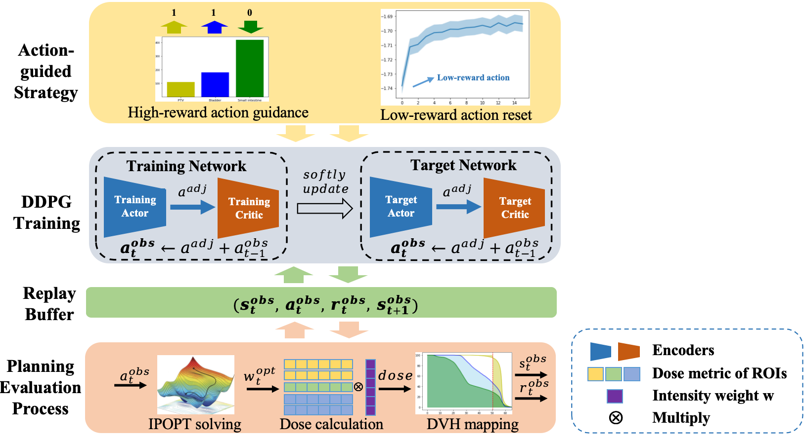








  &emsp;&emsp;Chengrong Yu, Ph.D. in Engineering, currently serves as an Assistant Researcher at the School of Software, Yunnan University, is member of the Chinese Association for Artificial Intelligence (CAAI), and the China Computer Federation (CCF).  I received my Ph.D. from Sichuan University under the supervision of Professor Zhang Yi (章毅 教授). \
  &emsp;&emsp;My research interests are centered on artificial intelligence and its applications in the medical field, with particular emphasis on multimodal medical image analysis and intelligent radiotherapy planning. To date, I have published more than 10 papers in peer-reviewed journals such as Knowledge-Based Systems, Neurocomputing, and the International Journal of Neural Systems, holds five authorized invention patents, and serves as a reviewer for leading international conferences including CVPR and NeurIPS. \
   &emsp;&emsp;More information about my research <a href='https://scholar.google.com/citations?user=DhtAFkwAAAAJ'>Google Scholar</a>, or don’t hesitate to contact me via email at <a href='yuchengrong@yun.edu.cn'>yuchengrong@yun.edu.cn</a>.

# 🔥 News
- *2025.09*: &nbsp;🎉🎉 Enrolled in the School of Software, Yunnan University🎓. Custom makes all things easy！

# 📝 Publications 

International Journal of Neural Systems

[Enhancing Exploration and Exploitation in Tumor Treatment Through Action-Guided Deep Reinforcement Learning](https://www.worldscientific.com/doi/full/10.1142/S0129065726500206)
**Chengrong Yu**, Zhonglian Wei, Yuncheng Shen, Yingyong Yin, Zhang Yi, Ying Song, Guangjun Li, Junjie Hu

- [Lorem ipsum dolor sit amet, consectetur adipiscing elit. Vivamus ornare aliquet ipsum, ac tempus justo dapibus sit amet](https://github.com), A, B, C, **CVPR 2020**

# 📖 Educations
- *2019.09 - 2024.12*, Sichuan University. Ph.D. in Computer Science and Technology. 
- *2016.09 - 2019.12*, Kunming University of Science and Technology. M.S. in Computer System Architecture. 
- *2012.09 - 2016.12*, Nanchang University. B.S. in Software Engineering. 

